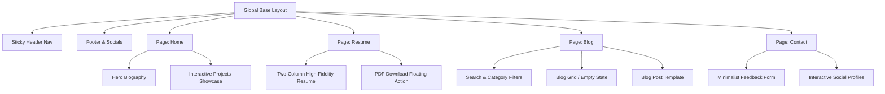

# Product Requirements Document (PRD) & UI/UX Design Specification
## Project: Premium Full-Stack Engineer Portfolio

This specification is designed for **Stitch (AI Design Tool)** to generate high-fidelity, production-quality visual layouts and CSS/Tailwind design tokens for a minimalist, ultra-high-performance professional engineering portfolio.

---

## 1. Core Visual Concept & Identity

* **Theme & Vibe:** Cyber-Minimalism & High-Performance. The aesthetic must feel extremely premium, developer-centric, clean, and modern. 
* **Design Pillars:** 
  1. **Glassmorphism:** Use soft backdrop-blur card layers and subtle glowing borders to create depth.
  2. **Content-First:** Typographical hierarchy should lead the eye directly to project metrics, technical depth, and call-to-actions.
  3. **Fluid Motion:** Micro-interactions and state changes must feel responsive and organic (hover animations, spring transitions).

---

## 2. Global Design Tokens (Tailwind CSS Configuration)

### Color Palette (Dark-Mode Centric)
The primary mode is dark. A system-aware toggle allows light mode fallback.

| Token Name | Light Mode Value | Dark Mode Value | Semantic Purpose / Usage |
| :--- | :--- | :--- | :--- |
| `background` | `#F8FAFC` (Slate 50) | `#030712` (Gray 950) | Main viewport canvas background |
| `surface` | `#FFFFFF` (White) | `#0B1329` (Deep Obsidian) | Cards, panels, modal container surfaces |
| `border` | `#E2E8F0` (Slate 200) | `#1E293B` (Slate 800) | Card outlines, dividers, input borders |
| `text-primary` | `#0F172A` (Slate 900) | `#F8FAFC` (Slate 50) | Headings, main text, high emphasis |
| `text-secondary` | `#475569` (Slate 600) | `#94A3B8` (Slate 400) | Descriptions, dates, body copy, low emphasis |
| `primary` | `#4F46E5` (Indigo 600) | `#6366F1` (Indigo 500) | Main action color, buttons, active states |
| `accent-glow` | `#06B6D4` (Cyan 500) | `#A855F7` (Purple 500) | Highlight text, gradient stops, hover glows |
| `success` | `#16A34A` (Green 600) | `#10B981` (Emerald 500) | Metrics, positive indicators, success states |

### Gradient Utilities
* **Hero Text Gradient:** `from-indigo-500 via-purple-500 to-pink-500` (Linear 135deg)
* **Accent Border Gradient:** `from-slate-800 to-indigo-900/40` (Linear 45deg)
* **Hover Accent Gradient:** `from-indigo-500/10 to-purple-500/10`

### Typography (Google Fonts)
* **Headings:** `Outfit` (Sans-serif) - clean, geometric curves, modern.
* **Body & UI:** `Inter` (Sans-serif) - exceptional readability, neutral spacing.
* **Monospace (Code/Tech Tags):** `JetBrains Mono` - technical, crisp line-heights.

### Border Radii & Shadows
* **Card Radius:** `16px` (`rounded-2xl`)
* **Button/Input Radius:** `8px` (`rounded-lg`)
* **Elevated Shadow (Dark):** `0 10px 30px -10px rgba(0, 0, 0, 0.7)`
* **Active State Glow:** `0 0 20px 2px rgba(99, 102, 241, 0.15)`

---

## 3. Component & Layout Specifications

### A. Global Layout (Shell)
* **Sticky Navigation Header:**
  * **Visuals:** Height `64px`, `backdrop-blur-md`, background transparency 80% (`bg-opacity-80`). Very thin bottom border (`border-b border-opacity-50`).
  * **Left Side:** Logo text in `Outfit` (e.g., `[DeveloperName]`), semi-bold.
  * **Right Side:** Desktop nav links (Home, Blog, Resume, Contact) with a sliding active line marker underneath. System-aware theme toggle switch (Sun/Moon icon transitions).
  * **Mobile:** A compact hamburger icon that opens a full-screen sliding overlay using a `spring` animation curve.
* **Global Footer:**
  * **Visuals:** Padded (`py-8`), subtle top border.
  * **Content:** Minimal copyright disclaimer on the left; clean icon links for GitHub, LinkedIn, and email on the right. Icons must shift from grey to indigo on hover.

---

### B. Page 1: Home (Biography & Projects Grid)
* **Section 1: Hero & Bio**
  * **Layout:** Centered or asymmetric 60/40 split on desktop.
  * **Elements:**
    * A subtle, animated backdrop mesh gradient (`indigo`/`purple`/`transparent`) slowly floating in the background.
    * A high-impact headline in `Outfit` (72px on desktop, bold): *"Building scalable, elegant systems from front to back."* (Use gradient text masking).
    * Bio text (Inter, 18px, relaxed line-height): A concise paragraph describing senior-level full-stack expertise, focusing on performance, reliability, and modern tooling (Bun, 11ty, TypeScript).
    * Core stack badge grid: Flat, semi-transparent grey capsules (`bg-slate-800/40`) with tiny technology icons and names (e.g., Node.js, TS, Rust, Postgres).
* **Section 2: Projects Showcase**
  * **Layout:** Responsive 2-column grid (`grid-cols-1 md:grid-cols-2 gap-8`).
  * **Project Card Design:**
    * Background: Glassmorphic surface (`bg-slate-900/50 backdrop-blur-sm`).
    * Image: A 16:9 ratio card header image with a soft zoom effect on hover (`scale-105 duration-500`).
    * Title & Subtitle: Clean heading with a tag detailing the role (e.g., *Lead Architect*).
    * **Impact Metrics Box (Crucial):** A highlighted secondary container inside the card (`bg-slate-950/60 rounded-lg p-3 border border-slate-800`). Contains bullet-point stats with green success markers: 
      * `✓ 40% reduction in page load latency`
      * `✓ Handled 5k+ requests/sec under load`
    * Technology Tags: Small text capsules listing tools used.
    * Link buttons: Solid Indigo button for "Live Demo", outline Slate button for "View Code" (both including minimal icons).

---

### C. Page 2: High-Fidelity Resume
* **Layout:** Clean two-column layout on desktop (`md:grid-cols-3 gap-8`), stacking on mobile.
* **Left Column (1/3 Width):**
  * **Avatar/Identity Summary:** Compact profile picture with name and title.
  * **Contact Cards:** Clean items with icons for Location, Email, and Phone.
  * **Skills Inventory:** Grouped categories (Languages, Frontend, Backend, Devops). Each skill displayed as a subtle pill badge.
  * **Education & Certifications:** Simple list with dates, degree, and institution.
* **Right Column (2/3 Width):**
  * **Work Experience Timeline:**
    * Visuals: A thin vertical line in Slate-800 runs down the left margin, with solid indigo nodes at each job transition.
    * Structure: Each role has Job Title, Company Name (clickable link), Dates, and location.
    * Description: Bullets emphasizing technical challenge, execution, and quantifiable results.
* **Print Styles & Actions:**
  * Floating action button on desktop: "Download PDF" (Indigo icon that triggers PDF build/download).
  * Media queries must hide the navigation bar, footer, and theme selector, optimizing the layout to fit a standard A4/Letter page.

---

### D. Page 3: Blog Listing & Blog Post Template
* **Section 1: Blog Hub Listing**
  * **Search UI:** A wide, prominent search bar:
    * Rounded pill design (`rounded-full`), glassmorphic outline.
    * Left magnifying glass icon; right clear text button (`esc` key shortcut indicator).
    * Focused state shifts the border to Indigo and adds a soft blue shadow.
  * **Category Navigation:**
    * A horizontal scrollable list of filter chips (All, Architecture, Performance, Frontend, Tooling).
    * Selecting a chip animates its state (Solid Indigo background for active; transparent slate for inactive).
  * **Blog Post Grid:** 
    * A vertical list or simple cards displaying: Publish Date, Category tag (color-coded by category, e.g. Performance is Emerald), Title, Excerpt, and "5 min read" text.
  * **Empty State:**
    * Centered vector graphic or minimalist icon, text: *"No articles match your search criteria. Try clearing your filters."*

* **Section 2: Blog Post Template**
  * **Header Area:** 
    * Category breadcrumbs.
    * Major Title (Outfit, bold, 48px).
    * Sub-header: Date, Author Avatar, Estimated Reading Time.
    * Interactive share icons (Twitter/X, LinkedIn, Copy Link).
  * **Read Progress:** A fixed `1px` high-contrast indicator line at the top of the viewport tracking the scroll position.
  * **Content Container (Typography):**
    * Centered width (`max-w-3xl px-4`), generous line-height (`leading-relaxed`), font size `18px`.
    * Blockquotes: Inset left border (`border-l-4 border-indigo-500 bg-slate-900/30 p-4 rounded-r-lg`).
    * Inline code: Soft red/pink highlights with code tags.
    * **Code Blocks:** Dark slate background with a header bar displaying the file name/language (e.g. `index.ts`), and a "Copy" icon button in the upper right. Syntax colors must be clear and contrast-compliant.
    * Post Footer: "Back to Blog" navigation arrow and previous/next article card previews.

---

### E. Page 4: Contact Section
* **Visuals:** Minimalist glass panel Centered on the viewport.
* **Interactive Form:**
  * Form fields (Name, Email, Message) with floating labels. When clicked, label shrinks and slides upward.
  * Inputs have a subtle gradient outline on focus.
  * **Action Button:** Solid Indigo CTA button. On click/submit, shows a spinning loader icon, transitioning to a green success checkmark on completion.
* **Social Profiles Grid:** 
  * A series of grid cards (GitHub, LinkedIn, Email, Twitter/X) featuring modern visual icons, the handle/username, and a chevron that animates to the right on hover.

---

## 4. UI/UX Interaction Rules (For Stitch Generation)

### State Transitions (Transitions & Timing)
Use native CSS properties: `transition-all duration-300 ease-out`.

* **Button Hover:** Scale up 2% (`hover:scale-102`), shift background gradient color, and apply a drop-shadow glow.
* **Card Hover:** Lift up by `4px` (`-translate-y-1`), transition border color from slate to indigo, and activate the subtle shadow glow.
* **Link Hover:** Horizontal underline reveals itself from left-to-right on hover.
* **Input Focus:** Smooth transition to an indigo ring outline (`ring-2 ring-indigo-500`).

### Accessibility Standards (A11y)
* Contrast ratios must be verified at a minimum of `4.5:1` for regular text and `3:1` for large text (adhering to WCAG AA).
* Focus rings (`focus-visible:ring-2`) must be visible on keyboard navigation.
* Interactive buttons and links must contain descriptive `aria-label` tags.

---

## 5. Responsive Behavior Breakpoints

* **Mobile (up to 640px):**
  * Single column layouts for projects and resume.
  * Header displays name logo and compact hamburger menu.
  * Horizontal scrollable chips for blog categories.
* **Tablet (641px - 1024px):**
  * Projects grid transitions to 2-columns.
  * Biography text transitions to full width.
  * Navigation shifts to text links if spacing allows, otherwise maintains a drawer.
* **Desktop (1025px and up):**
  * Sidebar layouts on Resume enabled.
  * Navigation is fully open.
  * Max container width locked at `1280px` (`max-w-7xl px-8`) to prevent layout stretching on ultra-wide screens.
